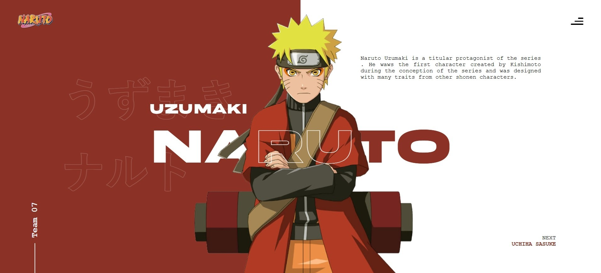
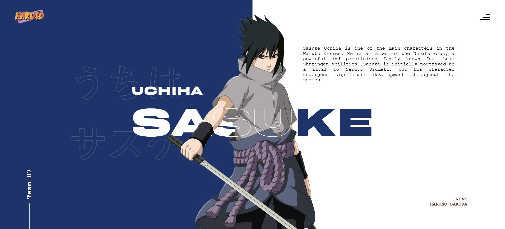
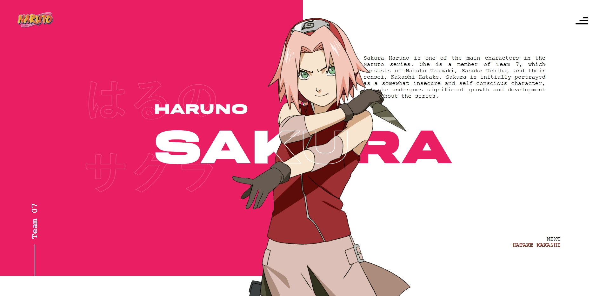
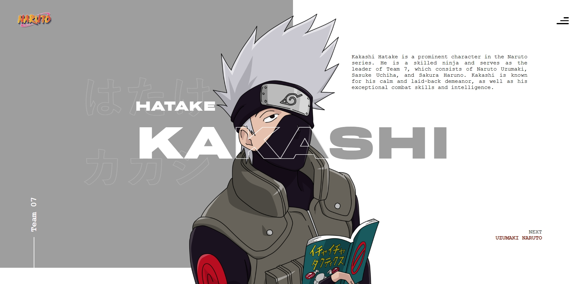

# Naruto Intro

Website Design inspired by the [Dribbble Design](https://dribbble.com/shots/15108926-Naruto-Web-Concept)

## 🎯 Purpose

The goal of this project is to get inspired by design and learn to recreate it using Web Technologies.

## 📸 Screenshots






## 🛠️ Setup & Installation

Follow these steps to get the project running on your local machine:

1.  **Prerequisites**: Ensure you have [Node.js](https://nodejs.org/) installed.
2.  **Clone the repository**:
    ```bash
    git clone <repository-url>
    cd naruto-intro
    ```
3.  **Install dependencies**:
    ```bash
    npm install
    ```

## 🚀 Usage

### Development Server

Run the development server to see the app in action:

```bash
npm start
# OR
ng serve
```

Navigate to `http://localhost:4200/`. The application will automatically reload if you change any of the source files.

### Build

To build the project for production:

```bash
npm run build
# OR
ng build
```

The build artifacts will be stored in the `dist/` directory.

### Running Tests

To execute unit tests:

```bash
npm test
# OR
ng test
```
